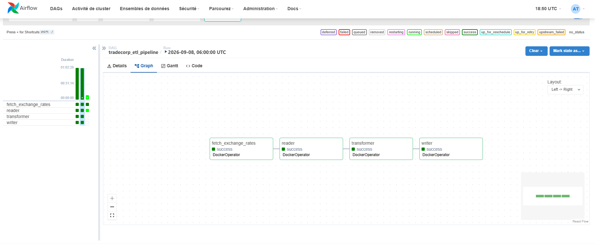
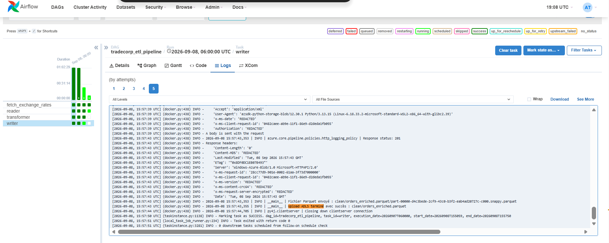
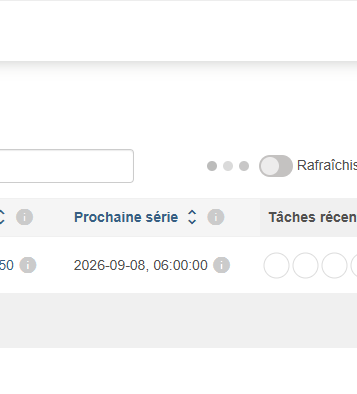
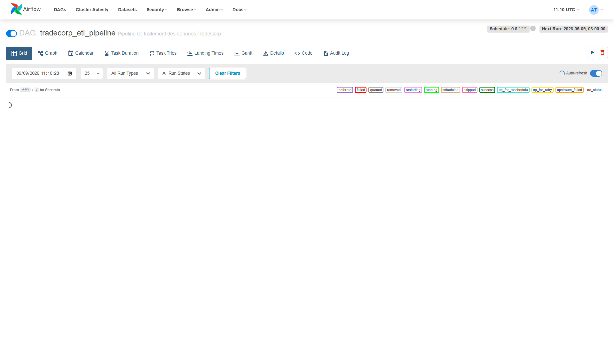
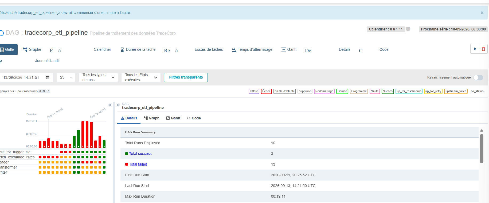
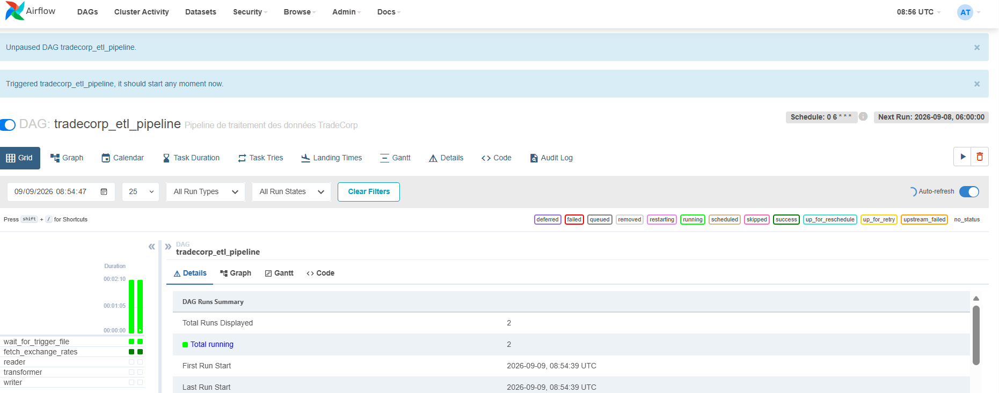
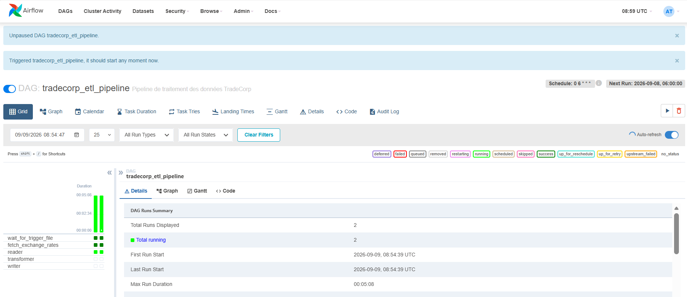

# TradeCorp Data Platform — Jalon 2 et 3

## Objectif

Ce projet transforme un prototype réalisé avec des notebooks en un pipeline PySpark modulaire, testable et exécutable depuis un terminal.

Le pipeline :

1. télécharge huit fichiers CSV métier depuis ADLS Gen2 ;
2. nettoie et type les données ;
3. joint les sept tables nécessaires au résultat ;
4. ajoute la devise du client ;
5. convertit le sous-total dans cette devise ;
6. écrit le résultat au format Parquet dans la zone `clean`.

## Architecture

```text
jalon2_tradecorp_modulaire/
├── data/
│   ├── raw/
│   │   └── reference/
│   │       └── country_currency.csv
│   └── tmp/
├── src/
│   ├── utils.py
│   ├── reader.py
│   ├── transformer.py
│   ├── enrichment.py
│   ├── writer.py
│   ├── pipeline.py
│   ├── fetch_exchange_rates.py
│   └── upload_country_currency.py
├── tests/
│   ├── test_transformers.py
│   └── run_tests.py
├── .env.example
├── .gitignore
├── Dockerfile
├── docker-compose.yml
├── requirements.txt
└── README.md
```

## Responsabilité des modules

- `utils.py` : connexion ADLS et fonctions de nettoyage.
- `reader.py` : téléchargement et lecture des données.
- `transformer.py` : jointures des tables métier.
- `enrichment.py` : ajout de la devise et conversion monétaire.
- `writer.py` : écriture Parquet et upload vers ADLS.
- `pipeline.py` : orchestration, journalisation et gestion des erreurs.
- `fetch_exchange_rates.py` : récupération quotidienne des taux.
- `upload_country_currency.py` : upload unique du mapping pays-devise.

## Dépendances

Les dépendances ajoutées à l’image Spark sont :

```text
azure-storage-blob
requests
pytest
```

PySpark est déjà fourni par l’image Docker de base.

## Configuration

Créer un fichier `.env` à partir de `.env.example` :

```powershell
Copy-Item .env.example .env
```

Renseigner ensuite les paramètres Azure :

```dotenv
AZURE_STORAGE_ACCOUNT_NAME=nom_du_compte
AZURE_STORAGE_ACCOUNT_KEY=cle_du_compte

AZURE_RAW_CONTAINER=raw
AZURE_RAW_REFERENCE_PATH=reference
AZURE_CLEAN_CONTAINER=clean

LOCAL_TMP_DIR=/home/jovyan/data/tmp
CLEAN_OUTPUT_PATH=orders_enriched.parquet
```

`AZURE_STORAGE_ACCOUNT_NAME` contient uniquement le nom du compte, sans URL.

Le fichier `.env` contient un secret et ne doit jamais être versionné.

## Construction du conteneur

```powershell
docker compose up -d --build
docker compose ps
```

Le nouveau projet utilise :

- le port `8890` pour JupyterLab ;
- le port `4050` pour Spark UI ;
- l’image `tradecorp-modulaire-pyspark:latest`.

## Upload initial du mapping pays-devise

Cette commande doit être exécutée une seule fois :

```powershell
docker compose exec spark python /home/jovyan/src/upload_country_currency.py
```

Destination :

```text
raw/reference/country_currency.csv
```

## Mise à jour quotidienne des taux

Le script appelle :

```text
https://api.exchangerate-api.com/v4/latest/USD
```

Exécution :

```powershell
docker compose exec spark python /home/jovyan/src/fetch_exchange_rates.py
```

Destination :

```text
raw/reference/exchange_rates.json
```

## Validation du lecteur

```powershell
docker compose exec spark spark-submit /home/jovyan/src/reader.py
```

Fichiers métier lus :

- `categories.csv`
- `customers.csv`
- `employees.csv`
- `order_details.csv`
- `orders.csv`
- `products.csv`
- `shippers.csv`
- `suppliers.csv`

Références lues :

- `reference/country_currency.csv`
- `reference/exchange_rates.json`

## Tests unitaires

Les tests doivent être exécutés avec `spark-submit` :

```powershell
docker compose exec spark spark-submit /home/jovyan/tests/run_tests.py
```

Résultat attendu :

```text
4 passed
```

Les tests vérifient :

- la suppression des commandes non livrées ;
- le calcul de `sous_total` ;
- le nettoyage des clients ;
- la conversion monétaire avec des taux simulés.

## Exécution du pipeline

```powershell
docker compose exec spark spark-submit /home/jovyan/src/pipeline.py
```

Ordre d’exécution :

```text
lecture → transformation → enrichissement → écriture
```

La SparkSession est arrêtée dans un bloc `finally`, même en cas d’erreur.

## Résultat attendu

Le pipeline produit 2 082 lignes et 23 colonnes :

```text
order_id
customer_id
employee_id
product_id
order_date
required_date
shipped_date
freight
is_shipped
prix_unitaire
quantite
discount
sous_total
customer_name
customer_country
customer_city
product_name
category_name
en_stock
full_name
shipper_name
currency
sous_total_local
```

Le résultat est envoyé vers :

```text
clean/orders_enriched.parquet
```

## Arrêt du nouveau conteneur

```powershell
docker compose down
```
## Jalon 3 — Orchestration avec Apache Airflow

### Objectif

Le jalon 3 ajoute Apache Airflow au pipeline modulaire du jalon 2.

Airflow ne réalise pas directement les transformations. Il orchestre des
conteneurs temporaires construits à partir de l'image PySpark du projet.

### Architecture Docker

L'infrastructure contient trois services :

- `spark` : environnement PySpark et JupyterLab ;
- `postgres` : base de métadonnées Airflow ;
- `airflow` : webserver, scheduler et exécution des tâches.

```text
Navigateur
    │ http://localhost:8081
    ▼
Airflow ──────────────► PostgreSQL
    │                    métadonnées
    │ DockerOperator
    ▼
Conteneurs PySpark temporaires
    │
    ├── src
    ├── data
    └── .env
```

L'image Airflow utilise :

```text
apache/airflow:2.8.0
apache-airflow-providers-docker:3.11.0
```

### Démarrage

```powershell
docker compose up -d --build
docker compose ps
```

L'interface est disponible à l'adresse :

```text
http://localhost:8081
```

Identifiants locaux :

```text
Utilisateur : admin
Mot de passe : admin
```

Le port `8081` est utilisé sur l'hôte afin d'éviter un conflit avec le
port `8080` déjà occupé.

### Configuration du DAG

Le DAG principal est défini dans :

```text
dags/tradecorp_etl_pipeline.py
```

Paramètres :

```text
dag_id          : tradecorp_etl_pipeline
date de début   : 2024-01-01
planification   : 0 6 * * *
catchup         : False
retries         : 1
retry_delay     : 5 minutes
max_active_runs : 1
tags            : tradecorp, etl, spark
```

L'expression cron `0 6 * * *` demande une planification quotidienne à
06:00 dans le fuseau horaire utilisé par Airflow.

`catchup=False` empêche Airflow de créer toutes les exécutions
historiques comprises entre le 1er janvier 2024 et la date actuelle.

`max_active_runs=1` empêche deux exécutions d'utiliser simultanément le
même répertoire de staging.

### Enchaînement des tâches

```text
wait_for_trigger_file
          │
          ▼
fetch_exchange_rates
          │
          ▼
       reader
          │
          ▼
     transformer
          │
          ▼
       writer
```

Les quatre étapes métier utilisent `DockerOperator`.

Chaque opérateur :

- lance l'image `tradecorp-modulaire-pyspark:latest` ;
- utilise le socket `/var/run/docker.sock` ;
- rejoint le réseau `tradecorp-modulaire-network` ;
- monte `src`, `data` et `.env` ;
- reçoit les secrets Azure avec `private_environment` ;
- supprime son conteneur après une exécution réussie.

### Échange de données entre les tâches

La tâche `reader` télécharge et conserve les entrées dans :

```text
/home/jovyan/data/tmp/airflow
```

La tâche `transformer` écrit son résultat dans la valeur définie par :

```dotenv
STAGING_PARQUET_PATH=/home/jovyan/data/staging/orders_enriched
```

La tâche `writer` lit ce même Parquet avant de l'envoyer dans :

```text
clean/orders_enriched.parquet/
```

### Déclenchement avec FileSensor

Le bonus `FileSensor` attend le fichier :

```text
data/trigger/go.txt
```

Création du signal :

```powershell
New-Item -ItemType File -Force .\data\trigger\go.txt
```

Suppression après l'exécution :

```powershell
Remove-Item -LiteralPath .\data\trigger\go.txt
```

Le mode `reschedule` libère le processus Airflow entre deux contrôles du
fichier.

### Extraits de logs validés

Lecture des taux :

```text
Taux de change chargés : 166
```

Résultat intermédiaire :

```text
Parquet intermédiaire : 2082 lignes, 23 colonnes
```

Upload final :

```text
Fichier Parquet envoyé : clean/orders_enriched.parquet/part-00000-031abd60-6125-4df3-8625-82e4eca84dfa-c000.snappy.parquet
Fichier Parquet envoyé : clean/orders_enriched.parquet/_SUCCESS
Écriture terminée avec succès : clean/orders_enriched.parquet
```

### Idempotence

Avant chaque upload, `writer.py` supprime les anciens blobs portant le
même préfixe. Le DataFrame est ensuite réduit avec `coalesce(1)`.

Après plusieurs exécutions, le répertoire final contient donc :

```text
un marqueur _SUCCESS
un seul fichier part-*.snappy.parquet
```

### Gestion et reprise d'un échec

Le scénario d'échec a été testé avec :

```dotenv
COUNTRY_CURRENCY_FILENAME=country_currency_missing.csv
```

Résultat observé :

```text
reader      : failed
transformer : upstream_failed
writer      : upstream_failed
```

Après restauration de `country_currency.csv`, l'action **Clear** a été
appliquée à `reader` avec l'option **Downstream**.

Airflow a alors relancé uniquement :

```text
reader → transformer → writer
```

Les tâches déjà réussies n'ont pas été rejouées.

### Signification de Next Run

`Next Run` indique la prochaine exécution que le scheduler créera selon
l'expression `0 6 * * *`.

L'interface Airflow affiche les dates dans le fuseau configuré par
Airflow, ici UTC. La valeur ne correspond pas à un compte à rebours :
elle représente la prochaine échéance logique calculée par le
scheduler.

Avec `catchup=False`, Airflow n'essaie pas de recréer les exécutions
quotidiennes antérieures depuis 2024.

### Preuves d'exécution

#### Graphe et exécution réussie



#### Logs de la tâche writer



#### Prochaine exécution planifiée



#### Échec contrôlé de reader



#### Reprise après Clear



#### FileSensor en attente



#### FileSensor terminé

